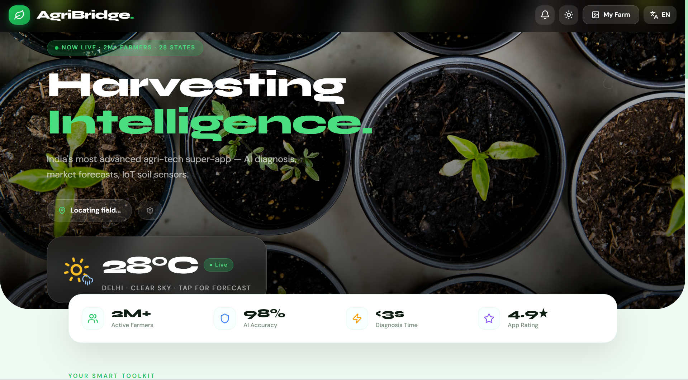
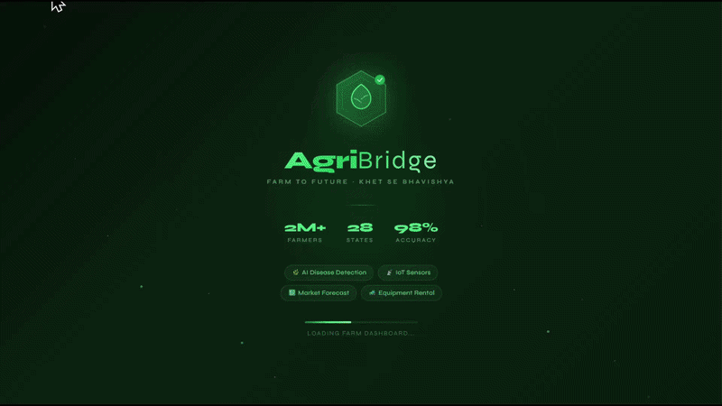
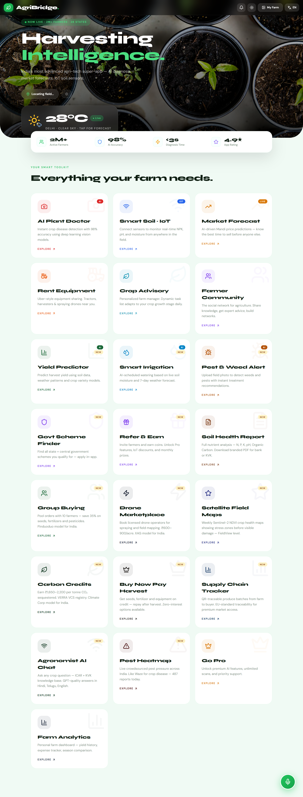
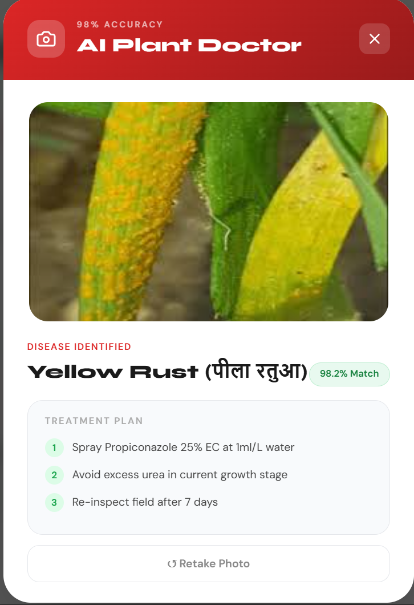
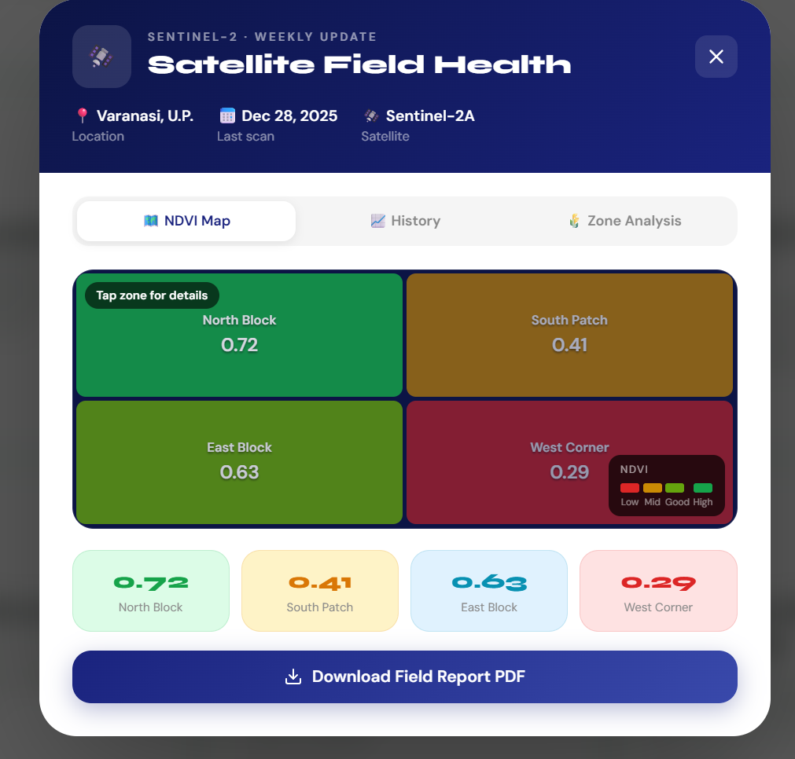
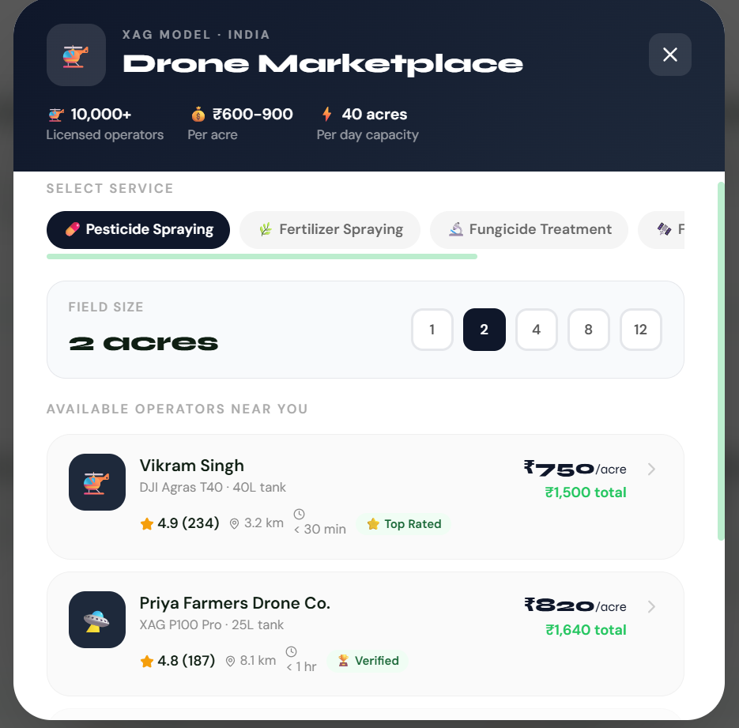
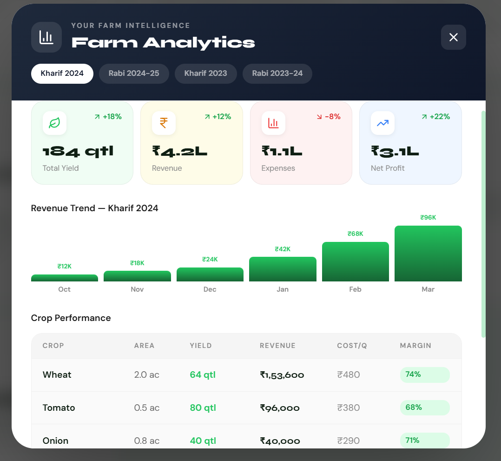
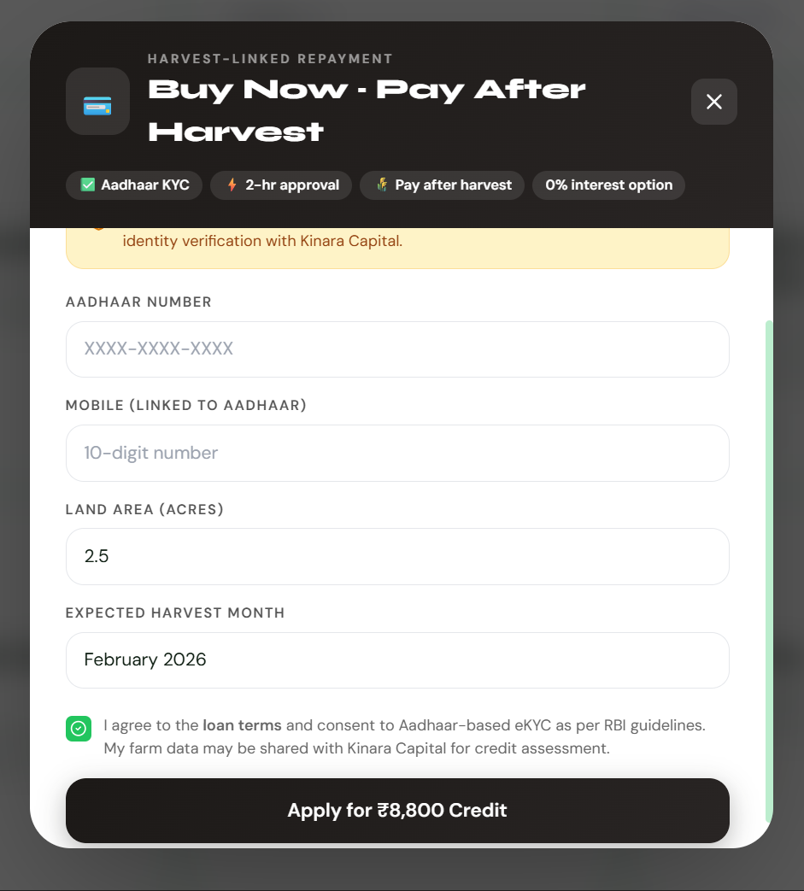

<div align="center">



<br/>
<br/>

# 🌾 AgriBridge AI

### India's AI-Powered Agricultural Intelligence Platform

*Transforming traditional farming into a predictive, intelligence-driven ecosystem*

<br/>

[](https://react.dev)
[](https://nodejs.org)
[](https://expressjs.com)
[](LICENSE)
[]()
[](CONTRIBUTING.md)
<p align="center">
  <a href="https://github.com/your-github-username">
    
  </a>
  <a href="https://linkedin.com/in/your-linkedin">
    
  </a>
</p>
<br/>

[**Live Demo**](https://agribridge.vercel.app) · [**Documentation**](docs/) · [**Quick Start**](#-quick-start) · [**Architecture**](#-architecture)

</div>

---

## The Problem

Millions of Indian farmers operate in the dark — reactive to weather they can't predict, diseases they can't identify, and markets they can't access. Agricultural intelligence exists, but it's fragmented across dozens of disconnected tools.

**AgriBridge AI is the operating system that unifies them.**

---
# 🌍 Vision

AgriBridge AI aims to become the:

> **"Digital Operating System for Global Agriculture"**

The platform is designed to unify:

* AI-driven crop intelligence
* IoT-based precision farming
* Satellite monitoring
* Climate analytics
* Financial inclusion
* Marketplace logistics
* Carbon credit ecosystems
* Farm-to-fork traceability

Long-term vision includes enabling:

* Autonomous smart farming
* Rural financial empowerment
* Climate-resilient agriculture
* Predictive food supply systems
* AI-assisted agronomy at scale

---
## 🎥 Product Walkthrough


<div align="center">



*Full platform walkthrough — dashboard to AI diagnosis to drone booking*

</div>

---

## ✨ Platform Overview

<div align="center">

| Module | Capability | Status |
|--------|-----------|--------|
| 🌿 **AI Plant Doctor** | Disease detection via Computer Vision | ✅ Live |
| 🛰️ **Satellite Intelligence** | NDVI crop monitoring via Sentinel-2 | ✅ Live |
| 🚁 **Drone Marketplace** | Uber-style precision spraying booking | ✅ Live |
| 💧 **Smart Irrigation** | AI-driven water recommendations | ✅ Live |
| 📊 **Farm Analytics** | Yield prediction & revenue forecasting | ✅ Live |
| 💳 **Harvest Fintech** | BNPL & carbon credit marketplace | ✅ Live |
| 🤖 **AI Agronomist** | LLM-powered crop advisory chatbot | 🔄 Beta |
| 🔗 **Supply Chain** | QR-based farm-to-fork traceability | 🔄 Beta |

</div>

---

## 📸 Screenshots

### 🌾 Dashboard



*Real-time farm health, NDVI scores, yield forecasts, and smart alerts in one view*

---

### 🌿 AI Plant Doctor



*Upload a leaf photo. Get disease diagnosis + treatment plan in under 3 seconds*

---

### 🛰️ Satellite Intelligence



*Sentinel-2 NDVI heatmaps, crop stress zones, and yield forecasting at field scale*

---

### 🚁 Drone Marketplace



*Find, book, and pay verified drone operators for precision pesticide spraying*

---

### 📊 Farm Analytics



*Revenue projections, expense breakdown, and seasonal crop performance benchmarks*

---

### 💳 Harvest-Linked Repayment



*Buy inputs now, repay after harvest. Credit scoring aligned to crop cycles*

---

## 🏗️ Architecture

```
┌─────────────────────────────────────────────────────────────────┐
│                     React 19 PWA Frontend                       │
│              Mobile-first · Offline-ready · Multilingual        │
└───────────────────────────┬─────────────────────────────────────┘
                             │  REST APIs / Socket.io
          ┌──────────────────┴──────────────────────┐
          │                                         │
┌─────────────────────┐              ┌──────────────────────────┐
│   Express Backend   │              │    AI Intelligence Layer │
│  Auth · Marketplace │              │  Disease Detection · ML  │
│  Payments · Alerts  │              │  Yield Prediction · NDVI │
└──────────┬──────────┘              └────────────┬─────────────┘
           │                                      │
           └──────────────────┬───────────────────┘
                              │
          ┌───────────────────┴──────────────────┐
          │                                      │
┌─────────────────────┐          ┌───────────────────────────┐
│   External APIs     │          │  Cloud Infrastructure     │
│  OpenWeather · Razorpay        │  Vercel · Railway · Docker │
│  WhatsApp · Sentinel│          │  CI/CD · Monitoring        │
└─────────────────────┘          └───────────────────────────┘
```

---

## ⚙️ Tech Stack

<div align="center">

| Layer | Technology | Purpose |
|-------|-----------|---------|
| **Frontend** | React 19, Tailwind CSS, PWA | Mobile-first SPA with offline support |
| **Backend** | Node.js, Express.js, Socket.io | REST APIs + real-time communication |
| **Auth** | JWT + OTP verification | Secure stateless authentication |
| **AI / ML** | TensorFlow, OpenCV, CNN | Disease detection & yield prediction |
| **Satellite** | Sentinel-2, NDVI pipelines | Remote crop health monitoring |
| **Payments** | Razorpay | Farmer payments & BNPL |
| **Comms** | WhatsApp Business API | Alerts, reminders, AI advisories |
| **Deployment** | Vercel + Railway + Docker | Cloud-native, CI/CD automated |

</div>

---

# 🎨 UI/UX Highlights

AgriBridge AI follows a:

* Mobile-first architecture
* Accessibility-driven interface
* Rural-friendly UX strategy
* Minimal cognitive load design
* High-contrast visual hierarchy
* Fast onboarding workflows
* Offline-first usability

### UX Goals

* Simplify complex agricultural workflows
* Support low-bandwidth environments
* Enable multilingual accessibility
* Build trust for first-time digital users

---


## 🚀 Quick Start

### Prerequisites

```bash
node >= 18
npm or yarn
git
```

### 1. Clone

```bash
git clone https://github.com/your-username/agri-bridge-ai.git
cd agri-bridge-ai
```

### 2. Frontend

```bash
npm install
npm start
# → http://localhost:3000
```

### 3. Backend

```bash
cd server
npm install
npm run dev
# → http://localhost:5000
```

### 4. Environment

Create `server/.env`:

```env
PORT=5000
JWT_SECRET=your_secret_key
OPENWEATHER_API_KEY=your_api_key
RAZORPAY_KEY_ID=your_key
RAZORPAY_KEY_SECRET=your_secret
WHATSAPP_ACCESS_TOKEN=your_token
```

---

## 📁 Project Structure

```
agri-bridge-ai/
├── public/
│   ├── manifest.json          # PWA manifest
│   ├── sw.js                  # Service worker (offline)
│   └── robots.txt
│
├── src/
│   ├── components/            # Reusable UI components
│   ├── pages/                 # Route-level views
│   ├── services/              # API + external integrations
│   ├── hooks/                 # Custom React hooks
│   ├── utils/                 # Helpers & formatters
│   ├── i18n.js                # Multilingual config
│   └── App.js
│
├── server/
│   ├── routes/                # API route definitions
│   ├── controllers/           # Business logic
│   ├── middleware/            # Auth, rate-limiting, CORS
│   ├── services/              # AI, payments, WhatsApp
│   ├── config/                # Environment & DB config
│   └── index.js
│
├── docs/
│   └── screenshots/           # ← Drop your screenshots here
│       ├── dashboard.png
│       ├── plant-doctor.png
│       ├── satellite-intelligence.png
│       ├── drone-marketplace.png
│       ├── farm-analytics.png
│       ├── harvest-repayment.png
│       └── demo.gif           # ← Drop your demo.gif here
│
├── .github/
│   └── workflows/
│       └── ci-cd.yml          # GitHub Actions pipeline
│
├── docker/                    # Docker configs
├── tests/                     # Unit + integration tests
└── README.md
```

---

## 🚢 Deployment

### Vercel (Frontend)

```bash
npm install -g vercel
vercel --prod
```

### Railway (Backend)

```bash
railway up
```

### Docker

```bash
docker build -t agribridge-server ./server
docker run -p 5000:5000 --env-file server/.env agribridge-server
```

---

## 🌍 Use Cases

| User | Value |
|------|-------|
| 👨‍🌾 **Farmers** | AI-powered crop decisions, drone booking, harvest credit |
| 🏛️ **Government** | Rural digitization, policy analytics, crop intelligence |
| 🌱 **Cooperatives** | Group procurement, shared analytics, market access |
| 💰 **Lenders** | AI credit scoring, harvest-linked repayment data |
| 🌍 **Climate Orgs** | Carbon credit tracking, sustainability metrics |
| 🏢 **AgriTech B2B** | Intelligence APIs, white-label farm OS |

---

## 🛣️ Roadmap

- [ ] TypeScript migration
- [ ] Voice-based AI advisor (regional languages)
- [ ] IoT sensor integrations (Soil NPK hardware)
- [ ] Blockchain crop traceability
- [ ] Smart farm digital twins
- [ ] Kubernetes deployment
- [ ] Redis caching layer
- [ ] OpenAPI / Swagger docs

---

## 🤝 Contributing

Contributions, issues, and feature requests are welcome.

```bash
# Fork → Create branch → Commit → PR
git checkout -b feature/your-feature
git commit -m "feat: add your feature"
git push origin feature/your-feature
```

Please read [CONTRIBUTING.md](CONTRIBUTING.md) before submitting a pull request.

---

## 🔒 Security

AgriBridge AI takes security seriously. If you discover a vulnerability, please open a [security advisory](https://github.com/your-username/agri-bridge-ai/security/advisories/new) rather than a public issue.

See [SECURITY.md](SECURITY.md) for our disclosure policy.

---

## 📜 License

MIT License © 2026 [Jai Shankar](https://github.com/your-username)

---

<div align="center">

# 🌾 AgriBridge AI

### Harvesting Intelligence. Empowering Agriculture.

**Built for farmers. Engineered for scale. Powered by AI.**

⭐ Star the repository if you found this project valuable.

</div>
